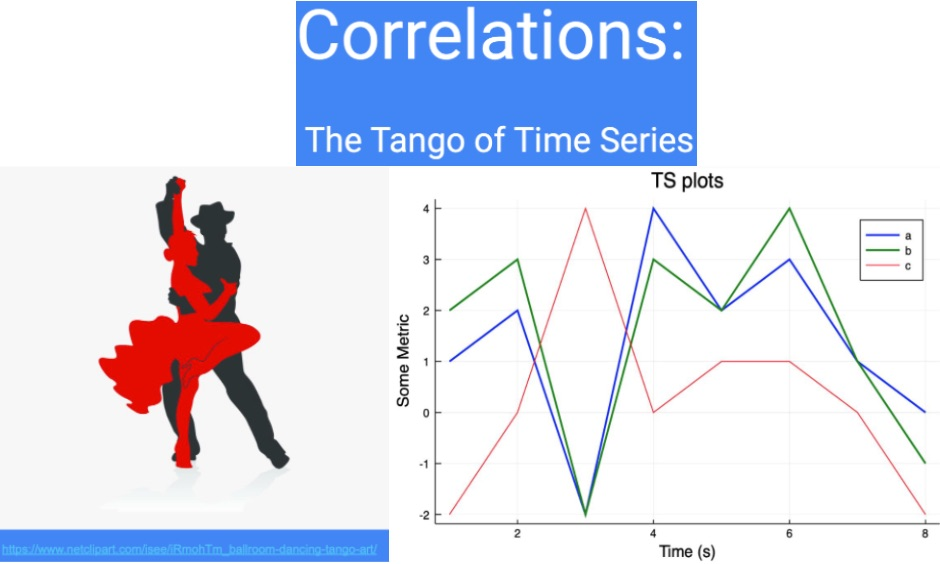

# Time Series Cross Correlations

<div align="center">
    
</div>

<br>

## Project Description

Analyzed time series data sets using various correlation measures to demonstrate how each correlation meaures work and
when you might use one technique over another.

## Objective

This repository contains Julia coded examples, image files, IJulia notebooks and other general materials related
to explaining the use of autocorrelation and cross-correlation analysis with time series data.

It includes a presentation deck for a Machine Learning technical meetup, "Learning Tuesdays", a biweekly talk given by a different member of the Akamai mPulse Data Science team. In this open source technical presentation, I hoped to educate the audience on what correlation analysis is and where and how it can play a role in investigating time series data.

## Tech Stack


[](#)


## Getting Started

You will need to install Julia and IJulia to utilize the Jupyter notebooks in this repository. Then, clone the repository and you are ready to go.

## Installation Steps

### Install Julia

You will need at least Julia version 1.4.0 or higher.

1. **juliaup**

A recommended way to install Julia is to install [juliaup](https://github.com/JuliaLang/juliaup) which is a small, self-contained binary that will automatically install the latest stable Julia binary and help keep it up to date. It also supports installing and using different versions of Julia simultaneously.

Install `juliaup` by running this in your terminal:

```
curl -fsSL https://install.julialang.org | sh

```

This command will install the latest stable version of Julia, which can be launched from a command-line by typing `julia` as well as the `juliaup` tool. To install different Julia versions see `juliaup --help`.

2. **Downloads**

If you want to manually download and install specific Julia versions, see the [Downloads](https://julialang.org/downloads/) page.

### Install IJulia to Use Jupyter Notebooks

Install `IJulia` using instructions [here](https://github.com/JuliaLang/IJulia.jl)

### Data Sources

[new-vs-returning-visitor.csv](https://anomaly.io/detect-anomalies-in-correlated-time-series/index.html) - Data used in analysis

## Final Words

Thanks for visiting.

Give the project a star (⭐) if you liked it or if it was instructional for you!

You've `beenlanced`! 😉

## Acknowledgements

This work was inspired by the good folks at:

- [Anomaly.io](https://anomaly.io/index.html) - Blog
- [Anomaly.io-post1](https://anomaly.io/detect-anomalies-in-correlated-time-series/index.html) - Anomaly Detection and Correlation
- [Anomaly.io-post2](https://anomaly.io/understand-auto-cross-correlation-normalized-shift/index.html#/cross_correlation) - Understanding Auto and Cross Correlations
- [Anomaly.io-post3](https://anomaly.io/detect-correlation-time-series/index.html) - Correlations in time series
- [Mersenne Twister](http://www.math.sci.hiroshima-u.ac.jp/~m-mat/MT/emt.html) - very fast randome number generator
- [Pearson Product-Moment Correlation Coefficient](https://en.wikipedia.org/wiki/Pearson_correlation_coefficient) - Pearson's r : linear correlation measure
- [Plotting in Julia](https://docs.juliaplots.org/latest/tutorial/) - How to use Julia Plot package

I would like to extend my gratitude to all the individuals and organizations who helped in the development and success of this project. Your support, whether through contributions, inspiration, or encouragement, have been invaluable. Thank you.

Specifically, I would like to acknowledge:

- The folks at [Julialang.org](https://julialang.org/) for their installation instructions and up-to-date information on the happenings with Julia.

- [Hema Kalyan Murapaka](https://www.linkedin.com/in/hemakalyan) and [Benito Martin](https://martindatasol.com/blog) for sharing their README.md templates upon which I have derieved my README.md.

## License

This project is licensed under the MIT License - see the [LICENSE](./LICENSE) file for details

